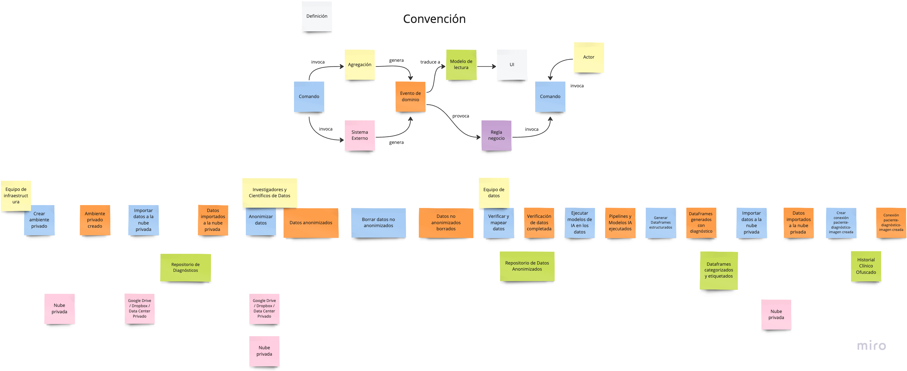
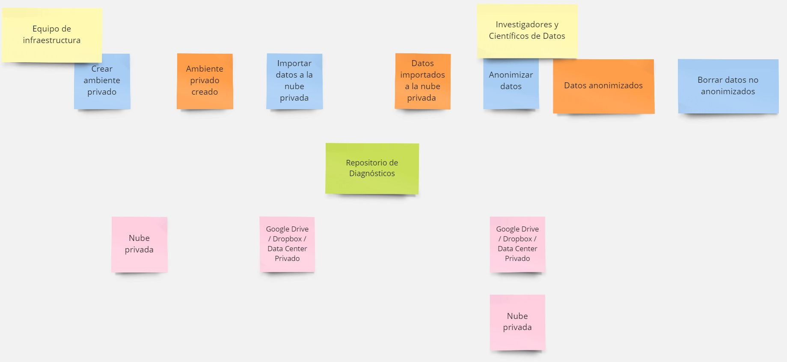
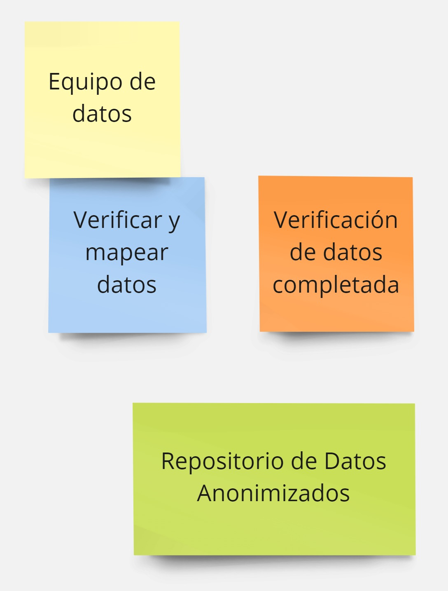
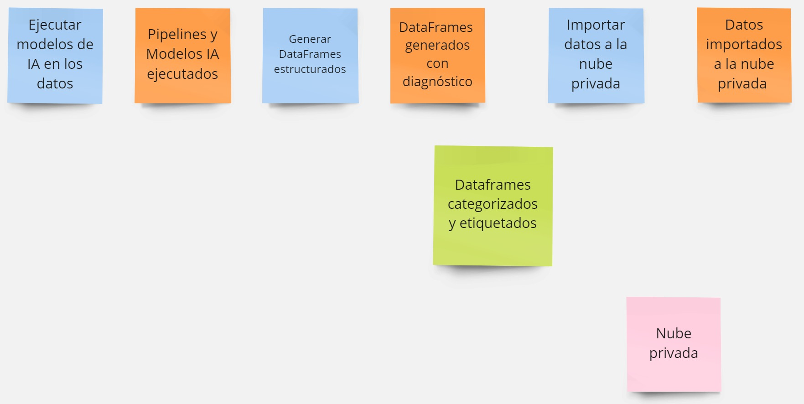
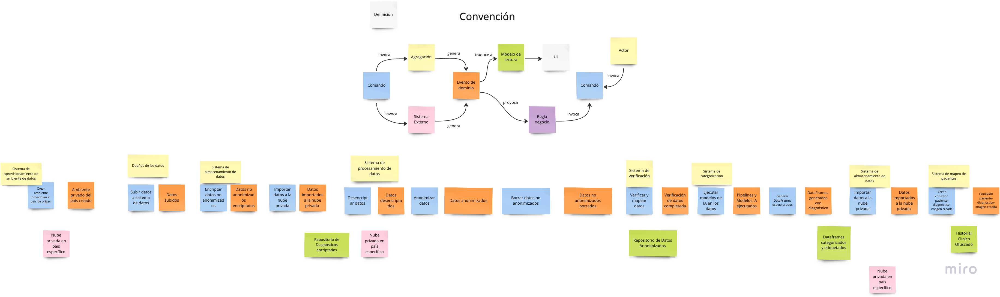
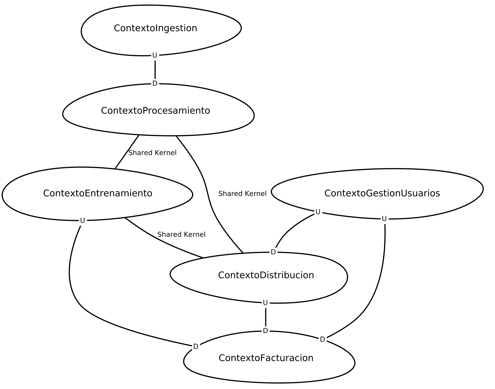
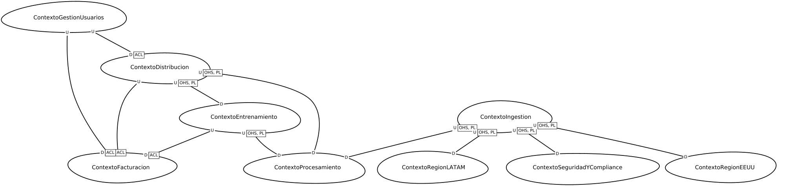

# Equipo MicroArquitectos

---

## Integrantes

* Nicolas Carvajal Chaves
* Wyo Hann Chu Mendez
* Sofia Velasquez Marin
* Valeria Caro Ramirez

---

## Descripción

A continuación se presenta el proyecto de la materia Diseño y construcción de soluciones no monolíticas, en el cual exploramos la división por dominios de Salud Tech de los Alpes. A continuación se muestran los hallazgos de los dominios de negocio, la documentación del lenguaje ubicuo con respecto al flujo de "anonimización,
ingestión y enriquecimiento de datos" AS-IS y TO-BE, y los contextos acotados AS-IS y TO-BE.
## Estructura del proyecto

```bash
.
├── README.md
├── build.gradle
├── gradle
├── gradle.properties
├── gradlew
├── gradlew.bat
├── images
├── settings.gradle
└── src (aquí encuentra los fragmentos de código para su calificación)
```

El proyecto cuenta con la estructura por defecto de un proyecto para correr `Context Mapper` en el cual se encuentran los archivos de configuración (`build.gradle`, `gradle.properties`, `gradlew`, `gradlew.bat`, `settings.gradle`) y la carpeta de `src/cml` en donde se encuentran donde se encuentran los archivos de código para generar los diagramas de Context Mapper. Puede visaulizar los diagramas con su respectiva información y comentarios. La carpeta `images` contiene las imágenes de los diagramas generados.

En el README se encuentra la información de los hallazgos de los dominios de negocio, la documentación del lenguaje ubicuo con respecto al flujo de "anonimización, ingestión y enriquecimiento de datos" AS-IS y TO-BE, y los contextos acotados AS-IS y TO-BE.

## Dominio de negocio

## **Dominio Principal**
| Dominio                        | Vision Statement                                                              |
|--------------------------------|-------------------------------------------------------------------------------|
| **InformacionImagenesMedicas** | Recaudar, procesar y distribuir imágenes médicas y diagnósticos anonimizados. |

## **Subdominios**
| Subdominio                               | Tipo              | Vision Statement                                                            |
|------------------------------------------|-------------------|-----------------------------------------------------------------------------|
| **Ingestion**                            | CORE_DOMAIN       | Recaudar y almacenar los datos de las imágenes médicas.                     |
| **Limpieza**                             | CORE_DOMAIN       | Limpiar y anonimizar los datos de las imágenes médicas.                     |
| **Procesamiento**                        | CORE_DOMAIN       | Estructuración y enriquecimiento de los datos de las imágenes médicas.      |
| **Distribucion**                         | CORE_DOMAIN       | Distribuir los datos de las imágenes médicas.                               |
| **Entrenamiento**                        | CORE_DOMAIN       | Crear los modelos, entrenamientos e investigación de las imágenes médicas.  |
| **Facturacion**                          | GENERIC_SUBDOMAIN | Facturar los servicios de las imágenes médicas y adquisición de datos.      |
| **GestionUsuarios**                      | GENERIC_SUBDOMAIN | Gestionar los usuarios y permisos de la plataforma de las imágenes médicas. |
| **Ventas**                               | SUPPORTING_DOMAIN | Contactar y vender los servicios Enterprise de las imágenes médicas.        |
| **SeguridadYCompliance (Solo en TO-BE)** | SUPPORTING_DOMAIN | Supervisar y regular los procesos de la operación de las imágenes médicas.  |
| **RegionEEUU (Solo en TO-BE)**           | SUPPORTING_DOMAIN | Segmentar y almacenar los datos de las imágenes médicas en EE.UU.           |
| **RegionLATAM (Solo en TO-BE)**          | SUPPORTING_DOMAIN | Segmentar y almacenar los datos de las imágenes médicas en LATAM.           |

## Lenguaje ubicuo flujo "anonimización, ingestión y enriquecimiento de datos"

### Convenciones

| **Tipo**               | **Elemento**                                   | **Descripción**                                                                                                                 |
|------------------------|------------------------------------------------|-------------------------------------------------------------------------------------------------------------------------------- |
| **Actor**              | **Equipo de infraestructura**                  | Equipo encargado de configurar la nube privada y realizar la importación inicial de datos médicos, asegurando el aislamiento y seguridad del ambiente.            |
| **Actor**              | **Investigadores y Científicos de Datos**      | Profesionales responsables de verificar, mapear y organizar los datos anonimizados para prepararlos para el análisis y la ejecución de modelos de IA.             |
| **Actor**              | **Equipo de datos**                            | Encargados de preparar, procesar, ejecutar modelos de IA y generar resultados estructurados a partir de los datos médicos anonimizados.                           |
| **Comando**            | **Crear ambiente privado**                     | Acción inicial para configurar un ecosistema seguro y aislado en la nube privada para cada partner o institución médica.                                           |
| **Comando**            | **Importar datos a la nube privada**           | Transferir datos médicos desde servicios externos (como Google Drive o un Data Center privado) hacia la infraestructura de nube privada.                         |
| **Comando**            | **Anonimizar datos**                           | Proceso de eliminación de información sensible de los datos médicos, utilizando scripts especializados para cumplir con regulaciones como HIPAA.                  |
| **Comando**            | **Borrar datos no anonimizados**               | Eliminar permanentemente los datos originales con información sensible una vez que han sido procesados y anonimizados.                                            |
| **Comando**            | **Verificar y mapear datos**                   | Revisar los datos anonimizados y organizar los archivos médicos y diagnósticos en grupos que faciliten el análisis y procesamiento.                               |
| **Comando**            | **Ejecutar modelos de IA en los datos**        | Aplicar modelos de inteligencia artificial previamente entrenados a los datos médicos organizados para obtener diagnósticos y análisis avanzados.                |
| **Comando**            | **Generar DataFrames estructurados**           | Crear estructuras de datos organizadas (DataFrames en formato parquet) que contienen información médica anonimizada y diagnósticos estructurados.                 |
| **Comando**            | **Crear conexión paciente-diagnóstico-imagen** | Generar un token único para asociar pacientes con diagnósticos e imágenes de manera anónima, asegurando privacidad y trazabilidad del historial clínico.          |
| **Evento de dominio**  | **Ambiente privado creado**                    | Se ha configurado exitosamente un ecosistema de nube privada para almacenar y procesar los datos médicos.                                                         |
| **Evento de dominio**  | **Datos importados a la nube privada**         | Los datos han sido trasladados desde la infraestructura del partner hacia el ecosistema de nube privada de manera segura.                                         |
| **Evento de dominio**  | **Datos anonimizados**                         | Los datos han sido procesados para eliminar cualquier información que permita identificar a los pacientes.                                                        |
| **Evento de dominio**  | **Datos no anonimizados borrados**             | Los datos originales con información sensible han sido eliminados para cumplir con las regulaciones de privacidad.                                                |
| **Evento de dominio**  | **Verificación de datos completada**           | Los datos han sido revisados manual y semiautomáticamente para asegurar que no contienen información sensible y están correctamente organizados.                  |
| **Evento de dominio**  | **Pipelines y Modelos IA ejecutados**          | Los pipelines de IA han sido ejecutados exitosamente para analizar y clasificar los datos médicos organizados.                                                    |
| **Evento de dominio**  | **DataFrames generados con diagnóstico**       | Se han creado estructuras de datos organizadas que contienen diagnósticos e información médica anonimizada.                                                       |
| **Evento de dominio**  | **Conexión paciente-diagnóstico-imagen creada**| Se ha generado una conexión única y anonimizada entre pacientes, diagnósticos e imágenes.                                                                         |
| **Modelo de lectura**  | **Repositorio de Diagnósticos**                | Base de datos temporal donde se almacenan los datos médicos importados antes de la anonimización. Facilita la organización inicial, verificación y procesamiento de los datos para su posterior anonimización y análisis.                                             |
| **Modelo de lectura**  | **Repositorio de Datos Anonimizados**          | Colección de datos médicos procesados y anonimizados listos para su uso en análisis o almacenamiento seguro.                                                      |
| **Modelo de lectura**  | **Dataframes categorizados y etiquetados**      | Conjunto de datos organizados y etiquetados en grupos según modalidad de examen, parte del cuerpo o diagnóstico patológico.                                        |
| **Modelo de lectura**  | **Historial Clínico Ofuscado**                 | Registro médico anonimizado que permite la trazabilidad de diagnósticos y tratamientos sin revelar la identidad del paciente.                                      |
| **Sistema Externo**    | **Nube privada**                               | Infraestructura tecnológica propiedad de STA donde se almacenan y procesan datos médicos de forma segura y aislada.                                               |
| **Sistema Externo**    | **Google Drive / Dropbox / Data Center Privado**| Servicios utilizados por los centros de salud para almacenar y transferir datos médicos antes de importarlos a la nube privada de STA.                            |


### AS-IS




**1. Preparación e Importación de Datos**



* **Crear ambiente privado:** El equipo de infraestructura configura un ambiente seguro y aislado en la nube privada de STA. Este ambiente es multitenant, lo que significa que los recursos físicos y virtuales están completamente separados entre partners. 

* **Importar datos a la nube privada:** Los datos médicos (como imágenes DICOM) son transferidos desde su origen (on-premise o servicios externos) hacia la nube privada.

* **Repositorio de Diagnósticos:** Los datos importados se almacenan temporalmente en el Repositorio de Diagnósticos. Este repositorio organiza los datos iniciales y facilita tareas como verificación, mapeo y preparación antes de ser procesados.

* **Anonimizar datos:** Los datos médicos en el Repositorio de Diagnósticos son procesados para eliminar cualquier información identificable mediante scripts especializados que aseguran el cumplimiento de regulaciones de privacidad.

* **Borrar datos no anonimizados:** Los datos originales que contienen información sensible son eliminados tras completar el proceso de anonimización.

**2. Verificación y Organización de Datos**



* **Verificar y mapear datos:** El equipo de datos revisa manual y semiautomáticamente los datos almacenados en el Repositorio de Diagnósticos. Durante esta etapa, los datos se agrupan y organizan en categorías basadas en modalidad de examen, región anatómica y patología/condición.

* **Verificación de datos completada:** Una vez los datos han sido revisados y mapeados correctamente, se completan las tareas de organización y clasificación, preparando los datos para la anonimización.

* **Repositorio de Datos Anonimizados:** Los datos verificados y organizados se transfieren al Repositorio de Datos Anonimizados tras el proceso de anonimización, garantizando que están listos para su análisis y almacenamiento seguro.

**3. Procesamiento y Análisis con IA**



* **Ejecutar modelos de IA en los datos:** Se ejecutan diferentes pipelines y modelos de IA entrenados específicamente para procesar los datos según los clusters o agrupaciones definidas en la etapa anterior. Los pipelines abarcan distintos enfoques, como: modalidad de examen, región anatómica y patología/condición.

* **Pipelines y Modelos IA ejecutados:** Una vez los modelos de IA procesan los datos, se generan resultados preliminares basados en los criterios de modalidad, parte del cuerpo y patologías.

* **Generar DataFrames estructurados:** Los resultados obtenidos se organizan en estructuras de datos bien definidas (como DataFrames en formato Parquet), que contienen información anonimizada junto con diagnósticos médicos.

* **DataFrames generados con diagnóstico:** Los DataFrames ahora contienen diagnósticos médicos relevantes y datos organizados, listos para ser utilizados en análisis futuros o investigaciones.

* **Dataframes categorizados y etiquetados:** Los DataFrames generados son categorizados y etiquetados con base en los criterios mencionados (modalidad, parte del cuerpo, patologías). Esto permite un acceso más estructurado y eficiente a la información.

**4. Generación de Conexiones y Persistencia**


* **Crear conexión paciente-diagnóstico-imagen:** Se genera un token único que asocia los datos anonimizados del paciente con sus diagnósticos e imágenes. Este identificador único permite la trazabilidad longitudinal de los datos médicos, asegurando que se pueda construir un historial clínico a lo largo de los años sin revelar información sensible.

* **Historial Clínico Ofuscado:** : Durante este proceso, se organiza un historial clínico anonimizado que permite mantener un registro completo y trazable de los datos médicos a lo largo del tiempo, sin revelar la identidad del paciente.

* **Conexión paciente-diagnóstico-imagen creada:** Una vez establecida la conexión, se confirma que los datos están correctamente vinculados de forma anonimizada, lo que permite una organización eficiente y un acceso seguro a los historiales clínicos.


### TO-BE



// TODO: Descripción del flujo TO-BE

## Contexto acotado

### AS-IS



// TODO: Descripción del contexto acotado AS-IS


### TO-BE



##### Contextos Acotados en InformacionImagenesMedicasMap_TO_BE

###### **Contextos Acotados**
| Contexto                         | Descripción                                                                                                                                                                |
|----------------------------------|----------------------------------------------------------------------------------------------------------------------------------------------------------------------------|
| **ContextoIngestion**            | Maneja la recolección, limpieza y almacenamiento de datos de imágenes médicas.                                                                                             |
| **ContextoProcesamiento**        | Estructura y enriquece los datos de las imágenes médicas antes de su uso en otros contextos.                                                                               |
| **ContextoDistribucion**         | Se encarga de la entrega de datos procesados a los diferentes consumidores, esto incluye tanto a clientes como a los expertos que se contratan para los planes enterprise. |
| **ContextoEntrenamiento**        | Administra la creación, entrenamiento e investigación de modelos basados en imágenes médicas cuando se solicita un plan enterprise.                                        |
| **ContextoFacturacion**          | Gestiona la facturación de los servicios de la compaía.                                                                                                                    |
| **ContextoGestionUsuarios**      | Administra usuarios y sus permisos dentro de la plataforma.                                                                                                                |
| **ContextoSeguridadYCompliance** | Supervisa la regulación y cumplimiento de normativas en la gestión de imágenes médicas.                                                                                    |
| **ContextoRegionEEUU**           | Maneja el almacenamiento y segmentación de datos en EE.UU., respetando normativas locales.                                                                                 |
| **ContextoRegionLATAM**          | Maneja el almacenamiento y segmentación de datos en LATAM, respetando normativas locales.                                                                                  |

---

## **Relaciones entre Contextos Acotados**
Las relaciones entre los contextos se justifican con los siguientes patrones:

1. **Uso de ACL (Anti-Corruption Layer)**: Se emplea en **Facturación y Gestión de Usuarios** para interactuar con sistemas externos y evitar el acoplamiento directo con modelos internos.
2. **Uso de OHS (Open Host Service) y PL (Published Language)**: Se aplica en los contextos de **Ingestión, Procesamiento, Distribución, Entrenamiento, Seguridad y Regiones** para proteger a los consumidores de cambios en el modelo y facilitar la traducción del modelo a un lenguaje publicado.

| Relación                                                       | Explicación                                                                                                                                   |
|----------------------------------------------------------------|-----------------------------------------------------------------------------------------------------------------------------------------------|
| **ContextoProcesamiento ← [OHS, PL] ContextoIngestion**        | El procesamiento depende de la ingesta de imágenes y debe recibir datos en un formato estable y estandarizado.                                |
| **ContextoProcesamiento ← [OHS, PL] ContextoDistribucion**     | La distribución usa los datos procesados, por lo que el modelo de datos debe mantenerse estable para los consumidores.                        |
| **ContextoProcesamiento ← [OHS, PL] ContextoEntrenamiento**    | Los modelos de entrenamiento dependen de los datos procesados de imágenes, por lo que necesitan una interfaz pública clara.                   |
| **ContextoEntrenamiento ← [OHS, PL] ContextoDistribucion**     | La distribución facilita el acceso a modelos entrenados, por lo que el lenguaje publicado es clave para interoperabilidad.                    |
| **ContextoFacturacion ← [ACL] ContextoEntrenamiento**          | Se usa ACL porque la facturación depende de información de modelos y entrenamientos que provienen de otro sistema.                            |
| **ContextoFacturacion ← [ACL] ContextoDistribucion**           | La facturación de acceso a datos y servicios de distribución requiere ACL para desacoplar la lógica de negocio. e ntegrar con otros sistemas. |
| **ContextoDistribucion ← [ACL] ContextoGestionUsuarios**       | Los permisos de usuarios impactan en la distribución de datos, por lo que se necesita ACL para interactuar con el sistema de autenticación.   |
| **ContextoFacturacion ← [ACL] ContextoGestionUsuarios**        | La facturación está ligada a la gestión de usuarios, y ACL permite integrar sin modificar modelos internos.                                   |
| **ContextoSeguridadYCompliance ← [OHS, PL] ContextoIngestion** | La seguridad y cumplimiento necesitan un acceso estable a la información ingerida, protegiéndose de cambios internos.                         |
| **ContextoRegionEEUU ← [OHS, PL] ContextoIngestion**           | Para garantizar normativas locales, este contexto consume datos ingeridos en un formato estandarizado.                                        |
| **ContextoRegionLATAM ← [OHS, PL] ContextoIngestion**          | Similar al contexto de EE.UU., este módulo necesita datos ingeridos en un formato predefinido para cumplir regulaciones.                      |
